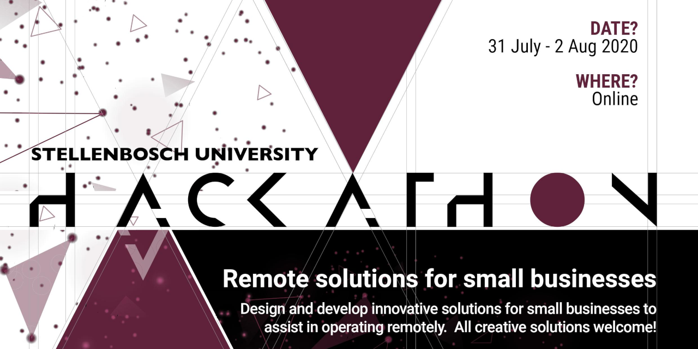

# Welcome to 2020 Stellenbosch University Hackathon

For this year's challenge we want you to build solutions that can help small businesses to function effectively in the new normal post-COVID. Think outside the box, i.e. don't just emulate existing solutions, but rather try to think of the challenges that small businesses face that no one is solving yet.

This year the entire event will be run remotely on MS Teams. As always business & tech mentors will be available from the sponsors to assist you. Please make use of their expertise.

The event officially starts at 6pm on Friday the 31st of July and ends at 12pm on Sunday the 2nd of August, meaning you'll have 42 hours to complete your solution.

At 12pm on the Sunday, you will pitch your solution to a panel of judges via a MS Team video call.

The rest of this guide sets out everything you need to know about the event.

1. [Judging Criteria](#1-judging-criteria)
2. [Pitching Tips](#2-pitching-tips)
3. [Starter Kit](#3-starter-kit)
4. [Additional Info](#4-additional-info)

## 1. Judging Criteria

The judges will subjectively evaluate all the pitches using the following criteria.

Criteria | Description
-------- | -----------
**Concept** | Did the group come up with a good solution to the initial problem or challenge? Did they understand and research the problem? Do they understand their end user's needs?
**Creativity** | How creative has the group been in solving the challenge? Did they come up with a radical approach, or did they follow existing patterns and solutions? Is this a differentiated idea in some way?
**Execution** | Does the hack work? Is the hack testable, and can the group show the minimum viable product? The hack does not have to be perfect or production ready, but does the idea come to life with their demo?
**Design** | Did the group think about the user interface (UI) and user experience (UX)? How well designed is their demo? How are the graphics, or how is the human-computer interaction? Is it easy to use or does it require a lot of training to master?
**Business Model / Impact** | Is the idea feasible, does it have economic and societal value, and is it sustainable? Will this be a viable business if the team develops the idea further?

**Note:** All decisions are final and will not be open to discussion.

## 2. Pitching Tips

From previous events we'd like to offer you the following tips:

* You'll have 7 minutes to pitch your solution to the judges, in that time it is your responsibility to give them enough info as per the above criteria to evaluate your solution.

* The judges will have 3 minutes to ask you clarifying questions, be brief and to the point in your answers.

* Don't just focus on your tech solution. Think though the business case of your solution, is it viable? will people use it? who is my target audience?

* Don't code to the last minute, rather reduce your scope lightly to make time to practice your presentation.

* A pitching workshop will be held before the event, please do make use of this to develop your skills.

## 3. Starter Kit

At most hackathons a lot of time is wasted in the intials stages setting up projects and making technology choices. To make things a bit easier this year we're providing you with a starter kit to get you up and running as quickly as possible.

**Note:** It is not mandatory to use this guide. If you have your own project template or want to build your solution in your own way or programming language, then please feel free to do so.

### 3.1. Overview

You can follow the rest of this guide to setup a basic cloud hosted web app. We'll be building a simple single page web applicaiton that will communicate with a 

### 3.2. Getting Started

TODO - forking instructions

### 3.3. Database (Object Storage)

TODO

### 3.4. Back-End (Cloud Functions)

TODO

### 3.5. Front-End (Web App)

TODO - pages hosting

## 4. Additional Info

This project is a quick start, and by no means a difinative source of information. Play around with it and make it your own.

For interest, the following additional resources may be of use to you:

### 4.1. IBM Cloud - Serverless Tutorial

This guide is roughly based of the IBM Cloud [Serverless web application and API](
https://cloud.ibm.com/docs/solution-tutorials?topic=solution-tutorials-serverless-api-webapp) tutorials. Have a look at the rest of their guide if you are interested.

### 4.2. IBM Cloud - Service Catalogue

You'll find a host of useful services in the IBM Cloud [Service Catalogue](https://cloud.ibm.com/catalog#services), from AI services to

### 4.3. GitHub Pages - Hosting Static Content

GitHub has added a feature called [GitHub Pages](https://pages.github.com/) to their platform allowing you to publically host your web app directly from the source code in your repository.

If your project requires dynamic content hosting then consider using the IBM CloudFoundry service.

### 4.4. Bootstrap 4 - UI Framework

[Bootstrap](https://getbootstrap.com/) is a simple open source responsive UI framework for web applications. It has many pre-defined components and templates. Use the following links to learn more.

* [Components](https://getbootstrap.com/docs/4.5/components/)
* [Template Examples](https://getbootstrap.com/docs/4.5/examples/)
* [Full Tutorial - W3schools](https://www.w3schools.com/bootstrap4/default.asp)

### 4.5. Modern Web APIs

The web has in recent years evolved to a point where it can compete head-on and with native applications like you would find on a desktop or smartphone. Web applications has the benefit of allowing you no longer have to build a separate Android, iOS and desktop version of you app. Apps like Slack and VS Code for instance is completely built on web technologies.

The following links provide some examples of how you can leverage these modern web APIs:

* [PWA - Installable Web Apps](https://web.dev/progressive-web-apps/)
* [WebRTC - Video Chat](https://codelabs.developers.google.com/codelabs/webrtc-web/)
* [Web Payments](https://web.dev/payments/)
* [Google Code Labs](https://codelabs.developers.google.com/)

### 4.6. Mobile Phone Emulation - Chrome

TODO
